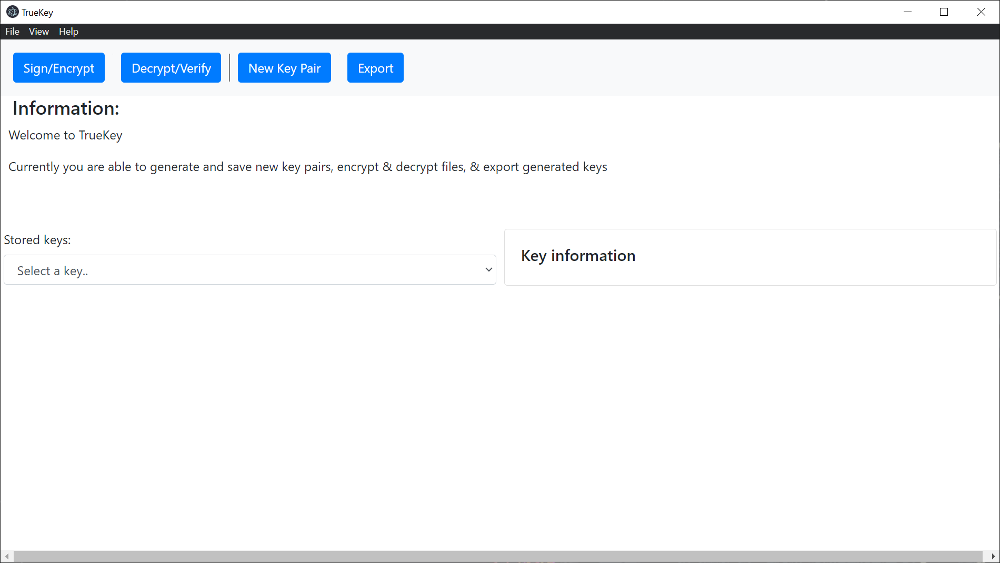
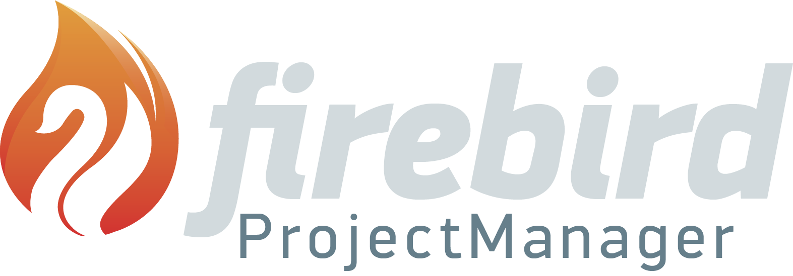
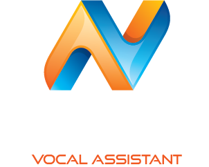
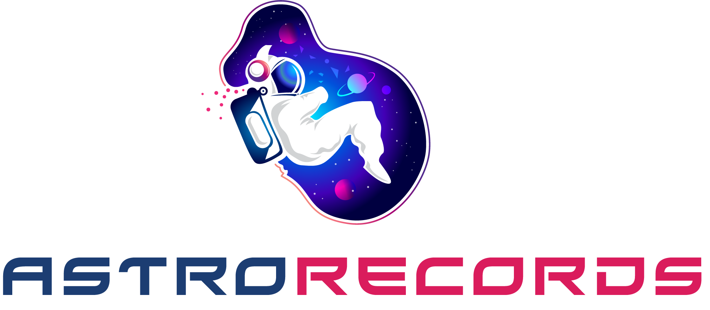
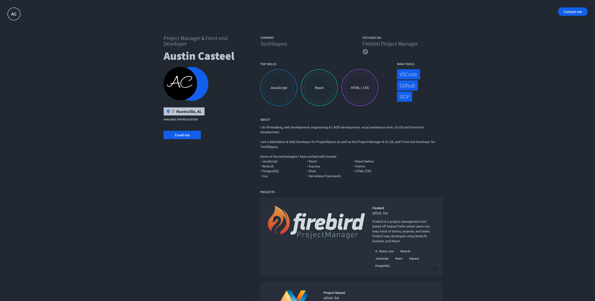
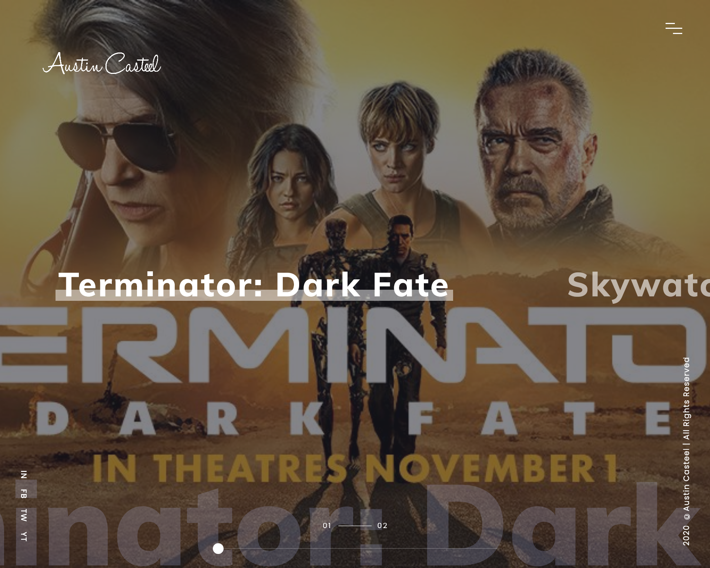
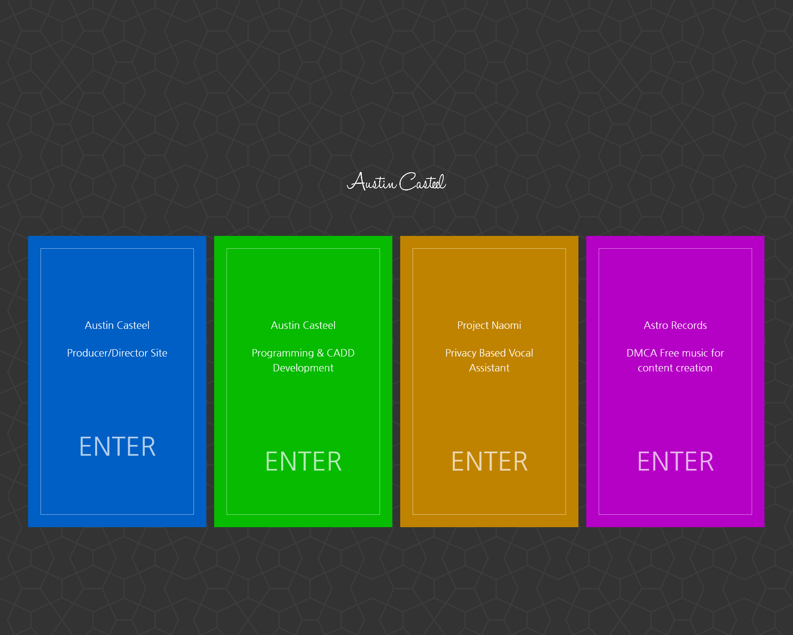

I always try to find time to work and learn something new. Usually, most of these _pet-projects_ don't see the light of day. They are, however, great opportunities to try something in the real world and learn from it. Here is a list of things I have done either for myself or for a company that I can share.

<table>
    <thead>
        <tr>
            <th>Logo</th>
            <th>Title</th>
            <th>Description</th>
            <th>Link</th>
            <th>Tags</th>
        </tr>
    </thead>
    <tbody>
         <tr>
            <td></td>
            <td>Techslayers</td>
            <td>TechSlayers developed an on-demand red team suite to validate your cybersecurity effectiveness through fully automated penetration tests while copying a hackers mindset.</td>
            <td>
                <a target="_blank" href="https://techslayers.com">site</a>
            </td>
            <td>
                GulpJS
                 
                Nunjucks
                 
                Scss
                 
                Vercel
            </td>
            <td>
                Live
            </td>
        </tr>
        <tr>
            <td></td>
            <td>RTS EM (Formally TrueKey)</td>
            <td>Red Team Suites Encryption Manager is a Dedicated TechSlayers encryption management program</td>
            <td>
                <a target="_blank" href="https://docs.techslayers.com">site</a>
                 
                <a target="_blank" href="https://github.com/Tech-Slayers/RTS-Encryption-Manager">github</a>
            </td>
            <td>
                NodeJS
                 
                Javascript
                 
                Electron
                 
                Encryption/Decryption
                 
                GPG
                 
                PGP
            </td>
            <td>
                Live
            </td>
        </tr>
        <tr>
            <td></td>
            <td>Firebird</td>
            <td>Firebird is a project management tool based off Asana/Trello/Zepel where users can keep track of teams, projects, and tasks. Firebird was developed using NodeJS, Express, and React.</td>
            <td>
                <a target="_blank" href="https://firebird.pm/">site</a>
                 
                <a target="_blank" href="https://github.com/Firebird/Firebird">github</a>
            </td>
            <td>
                NodeJS
                 
                Javascript
                 
                React
                 
                Express
                 
                PostgreSQL
            </td>
            <td>
                Offline
            </td>
        </tr>
        <tr>
            <td></td>
            <td>Project Naomi</td>
            <td>The Naomi Project is an open source, privacy focused, technology agnostic platform for developing always-on, voice-controlled applications!</td>
            <td>
                <a target="_blank" href="https://projectnaomi.com/">site</a>
                 
                <a target="_blank" href="https://github.com/naomiproject/Naomi">github</a>
            </td>
            <td>
                NodeJS
                 
                Javascript
                 
                Vue
                 
                Ruby
                 
                Shell
                 
                Python
                 
                Netlify
            </td>
            <td>
                Live
            </td>
        </tr>
        <tr>
            <td></td>
            <td>Astro Records</td>
            <td>Astro Records creates music that is safe for streaming and YouTube. Either play it from your favorite music app while you’re live or download it for free to use in your videos.</td>
            <td>
                <a target="_blank" href="https://astro-records.com/">site</a>
            </td>
            <td>
                Wordpress
            </td>
            <td>
                Live
            </td>
        </tr>
        <tr>
            <td></td>
            <td>Personal Code Site</td>
            <td>This is my personal code portfolio website</td>
            <td>
                <a target="_blank" href="https://code.austincasteel.com/">site</a>
                 
                <a target="_blank" href="https://github.com/AustinCasteel/Website/tree/Code">github</a>
            </td>
            <td>
                NodeJS
                 
                Javascript
                 
                Gatsby
                 
                Netlify
            </td>
            <td>
                Live
            </td>
        </tr>
        <tr>
            <td></td>
            <td>Personal PD Site</td>
            <td>This is my personal producer/director website for my multimedia & radio tv broadcasting work</td>
            <td>
                <a target="_blank" href="https://pd.austincasteel.com/">site</a>
            </td>
            <td>
                Wordpress
            </td>
            <td>
                Live
            </td>
        </tr>
        <tr>
            <td></td>
            <td>Personal Landing Site</td>
            <td>This is my personal landing page for my website</td>
            <td>
                <a target="_blank" href="https://austincasteel.com/">site</a>
                 
                <a target="_blank" href="https://github.com/AustinCasteel/Website/">github</a>
            </td>
            <td>
                HTML
                 
                CSS
                 
                Javascript
                 
                Netlify
            </td>
            <td>
                Live
            </td>
        </tr>
        <tr>
            <td></td>
            <td>Aeronau</td>
            <td>Aeronau is a private American astronautical manufacturer and space transportation services company. We are both a research & development company as well as a manufacturing & payload delivery company.</td>
            <td>
                <a target="_blank" href="https://aeronau.com/">site</a>
            </td>
            <td>
            </td>
            <td>
                In Progress
            </td>
        </tr>
    </tbody>
</table>
