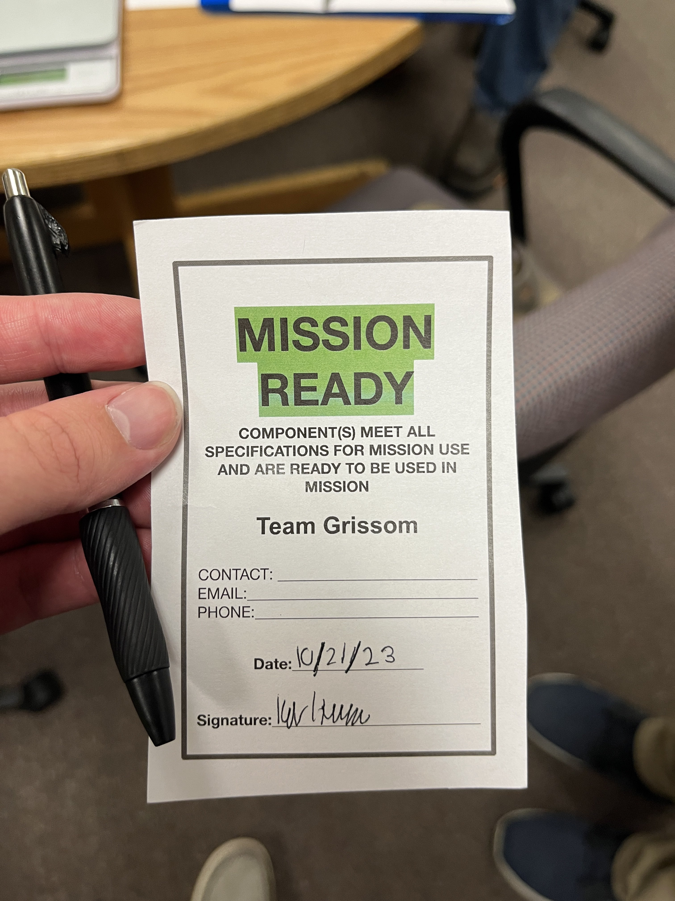

This is part 4 of a multipart series delving into the full process and results of VECTOR, a two month University of Alabama in Huntsville Space Hardware Club Challenge to Design, build, program, test, & fly an active payload stabilization system utilizing compressed gas and a series of thrusters to control payload rotation for collecting data during a balloon flight, with the unique challenge of recording stable video to an altitude of approximately 30 km.

## Spinning in Circles

At this point, we only had one and a half days left to get everything working properly for our scheduled Flight Readiness Review (FRR) time. All that was left to do was to get the RCS algorithm done and working. This ended up being the hardest part to accomplish and get working right. After what ended up being countless hours and days of rewriting the whole algorithm multiple times and even multithreading, we were finally getting close to what was needed.

<video width="480" height="852" controls muted>
  <source src="gallery1/01.mp4" type="video/mp4">
</video>

From the video, you can see that we were able to go from a starting orientation and turn 90 degrees. But instead of stopping when pointing where it was supposed to be, it just bounced back and forth between the plus and minus bounds. This oscillation was happening because the thrusters are on when trying to turn the craft, but once the craft is within its bounds, the thrusters turn off; however, momentum continues, causing it to go out of the other bounds, thus causing the oscillations back and forth. I had no dampening to slow the craft's spin rate to cause it to come to a stop when it is pointing at its target. I was able to dampen this a little bit by adjusting the bounds; however, I was not where it needed to be.

Another thing that came into consideration at the end was the fact that we are doing these tests at roughly 658 ft or 201 m above sea level. When the craft gains altitude and gets to its target and activation altitude, the thrusters are going to be stronger than they are down on the ground. To compensate for this difference, we went ahead and elected to lower our output pressure so the craft would not be overly powerful when at altitude. What this also meant that when testing on the ground, the impulse of the nozzles were so low that the it took the craft a long time to spin the 90 degrees for the test that once the thrusters turned of the spin rate would drop to zero within the bounds of the target until gravity and the line the craft was hanging on caused it to spin back the direction it came.

## FRR

From here, we decided it was good enough to go ahead and FRR. Now this is where the storytelling after the fact starts to fail. At this point, I have been in the lab working into the middle of the night every day this whole week. As a result, I know we failed our first FRR for something minor, tweaked things for a little bit, and then tried for a second time. The second attempt, our LEDs started to act up and stop working, which is a hard requirement. This was due to the way they were wired up; changing the wiring slightly fixed this issue. After all of this was said and done, we were on to our final FRR attempt. It was currently 3:15 am on Saturday, the 21st, the 21st being flight day. We were told that we had a hard stop at 3:30 to either pass or fail, or we would not fly. We start the FRR process at 3:15 and then issues.

Our craft randomly shut off after the shake test. Then, just as randomly, it turned back on. This proceeded to happen multiple times, meaning we were not going to pass. We were told we had 10 minutes left until 3:30 to try to fix the issue, or it would fail. After taking the craft apart and checking various connections, it appeared to be the switch that was not working in some form or fashion. As I would move the switch around with it toggled on, the craft would power on and off randomly. I knew the connections to the switch itself were perfect, so the only conclusion I could come up with was interference with other power lines that the connecting wires were pushed against due to placement. I adjusted the placement of the switch, and everything seemed to have worked, but then, right as we were about to say we were good, the craft shut off randomly again. At this point, I was very close to just calling it, as I had no idea what was wrong, and it was so late. I hated the feeling that everything would fall apart right at the finish line, but there was nothing I could do about it.

That was until I accidentally bumped the switch toggle itself. When doing so, the power tripped for the craft. After wiggling the switch, I was able to determine that the switch was faulty and the slightest movement was causing it to toggle back and forth without the switch being physically toggled. I announced that I found the issue, but due to the time, what should I do? The mentors looked at me and said, "Why are you still sitting there?". With that, I stood up, grabbed the payload, and rushed back to the lab to replace the switch. I will say, this was the fastest I have ever snipped and soldered something in my life. Within a couple of minutes, I was back with the payload, and we went through the FRR process for what would be our last change. And at 4:15 am we passed the FRR.

