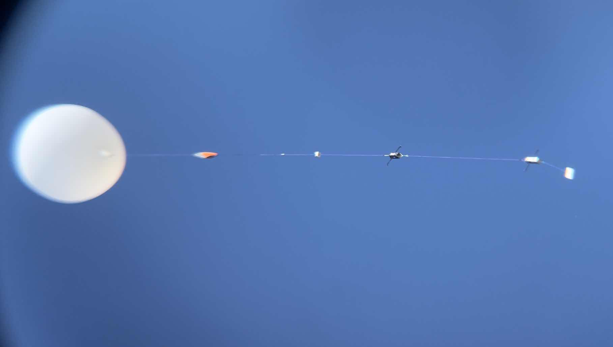
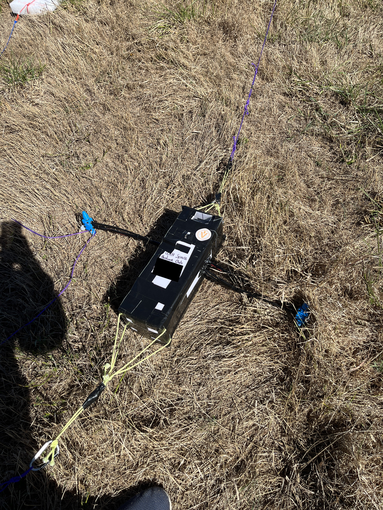
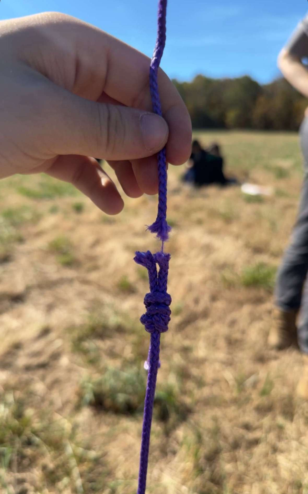

This is part 5 of a multipart series delving into the full process and results of VECTOR, a two month University of Alabama in Huntsville Space Hardware Club Challenge to Design, build, program, test, & fly an active payload stabilization system utilizing compressed gas and a series of thrusters to control payload rotation for collecting data during a balloon flight, with the unique challenge of recording stable video to an altitude of approximately 30 km.

## Flight

Due to passing FRR at 4:15 am, I ended up leaving the school at 4:30 am, got home at 5:30, twiddled my thumbs for an hour, and then got back on the road back to school to prep for flight. I arrived back at the school at 7:30 and started the flight day checklist. After loading up into vehicles, we made our way to our launch site.

The launch day process was pretty seamless. We took group team pictures, watched other challenges fly, and then came our turn to do final checks, power on, and attach to the line.





After 45 minutes of flight, we should have reached our target altitude to trigger RCS GO, then 30 minutes after, we had balloon teardown at a reported 26.4km. The whole line ended up landing where projected, and recovery went out Sunday morning to travel the few hours to go get it.

## Recovery

Upon locating the line, this is what we found.

VECTOR was fully intact with all signs pointing to positive results. According to the tracking, we knew the lines descended and the impact was quicker than expected. Upon investigation, the balloon did not tear down properly, causing its mass to be dragged along with the line, which caused the parachute to not operate nominally. However, there was one startling discovery upon recovery. The line between the parachute and VECTOR was holding on by a thread. This meant that if this line snapped, both VECTOR's & other teams' payload, as well as a weight, would have plummeted straight into the ground at terminal velocity.

## Data Processing

After the payload made the trip back to the lab, it was opened up, and the SD cards for the datalogger as well as the camera were extracted and parsed. The camera only recorded 40 minutes from the time of power on. This was an issue that was expected, but it was too late to fix. We elected to provide supplemental power from our payload power bank due to having a vast excess of power for our flight duration. However, something that was not realized until it was too late was that even though only 5V was being provided, the amperage was very high. This caused the camera to burn off the high amperage as heat, thus causing it to overheat and shut off.

After reviewing the log, there was some disappointment:

- The GPS dropped from perfect connection to no connection within a fourth of a second, 31 minutes after launch @ 12km
- At 46 minutes after launch, the barometer readings start to float. As if the balloon just bobbed up and down between 16751 & 16755 meters
- After 1hr 15min, the barometer started to read the descent past the float values it was stuck in
- At 1hr 21min, the payload fell below the 12km mark, and the GPS went from no connections to full saturation.

Along with these findings, the payload never came out of ascent mode due to incorrect altitude readings, thus meaning that RCS was never triggered. Here is the log:

> Too large to display the gist properly, Here is a direct link to it:

VECTOR Log


<!--  -->

At the time of writing, we still do not know why the baro stopped working.

As far as the other teams' payload, they did not fare any better. Their payload did not track or record any data, thus their RCS did not trigger as well. However, their camera did capture the full flight. Below is the flight as well as embeds and links to the data visualizations from the datalog of VECTOR, as well as the tracking box on the line in comparison.

### Flight Video



### VECTOR Visual


VECTOR Visual


### Tracking Box Visual


Tracking Box Visual


### Post Mortem

After all is said and done, I would like to retry and fly again to see if the RCS would have worked if the baro and GPS did not drop out. Unsure if VECTOR will fly again. Odds are that I will remake the whole payload myself, given time to be able to perfect the craft. Stay tuned!
